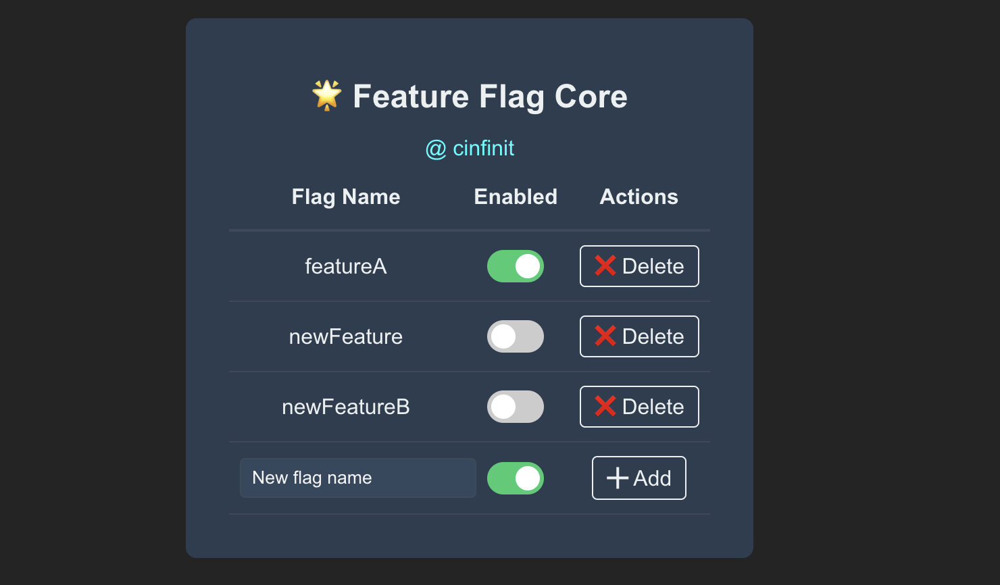

# 🎉 **Feature Flag Core** - Your New Best Friend for Managing Features (and Keeping Your Sanity Intact)

Managing features in your app is like juggling flaming swords. One wrong move, and it’s chaos. But with **Feature Flag Core**, you can tame those swords and keep everything in control without burning yourself out. 🔥
This manager really does the heavy lifting. THIS Manager ;)

---

## 🤖 **What is Feature Flag Core?**

Glad you asked! It’s the superhero of feature flags – think of it as the *Swiss Army Knife* for all your flag needs. You get a slick UI to toggle features, a local backend to keep things in check, and a hook to easily consume your flags in your app. Oh, and did we mention you can do all of this *without breaking a sweat*? 😎

### 🛠 **Features (AKA, What’s In It for You?)**

* **UI for Flag Management**: See all your flags in one place. Toggle them on, off, or somewhere in between (just like your mood on a Monday).
* **Local Backend**: Running your own local backend so you’re not at the mercy of some third-party service. Control is 🔑.
* **Easy Setup**: Just a couple of imports and boom – you’re in business.
* **Port Customization**: You can set it to any port (because we know you like options). Don’t let the port dictate your life. 👊

---

## 🧑‍💻 **How to Use It (AKA, Get It Up and Running in T-30 seconds or Less)**

### 1. **Set Up the Feature Flag Core UI**

First, install the module and add the UI:

```bash
npm install feature-flag-core
```

Now import the magic:

```javascript
import { FeatureFlagManager } from 'feature-flag-core'
import "feature-flag-core/dist/src/ui/toggleStyles.css"
```

Then, just place it in your app like this:

```javascript
<FeatureFlagManager />
```

### Demo


#### 🎛 **Optional Props:**

* `customUrl`: Want to use a custom backend URL? Go wild. (This will override the port.)
* `port`: Specify the port for the backend. (Defaults to `3231` because we like symmetry.)

---

### 2. **Use Flags in Your App (AKA, How to Stop Thinking and Let the Code Do the Work)**

Now that the UI is up and running, consuming flags is as easy as ordering pizza 🍕:

```javascript
import { useFlagFromApi } from 'feature-flag-core'

const flagValue = useFlagFromApi("your-flag-name")
```

This will give you a `true` or `false` value based on the flag’s state. It’s like flipping a switch, but *without* the annoying light flicker.

---

### 3. **Start Your Local Backend (AKA, The Magic That Makes It All Happen)**

You need a backend to manage those flags. Fire it up with:

```bash
feature-flag-cli
```

Or if you’re feeling fancy and need a custom port:

```bash
feature-flag-cli --port <yourPortNumber>
```

By default, it runs on port `3231` because, well, we’re into simplicity. But hey, you do you.

---

Feature Flag Core is here to save your life (or at least your production environment). It gives you the power to turn features on or off without a commit, without a deploy, and without begging for forgiveness later. 🙌

---

## 🤖 **Why Should You Care?**

Let’s be real. You don’t want to deploy every single time you want to turn a feature on or off. With Feature Flag Manager, you can:

* **Control**: The flags are in your hands. No more guessing.
* **Test**: Gradually roll out new features to specific users. It’s like A/B testing without the messy spreadsheets.
* **React Fast**: Features can be switched off at a moment’s notice, so if something goes wrong, you can recover faster than a cat falling off a counter.
* **Flexibility**: Run it locally, customize it, and make it work how *you* want.

---

## 🧩 **Use Cases (AKA, When You’ll Actually Need This)**

1. **Feature Testing**: Want to test that shiny new feature? Turn it on for a few users before rolling it out to everyone. Baby steps, people.
2. **A/B Testing**: Because who doesn’t love seeing what works best? Split users into groups and compare.
3. **Emergency Killswitch**: Feature’s broken? Hit the kill switch (no questions asked).
4. **Gradual Rollouts**: Want to release a feature to 5% of your users? Now you can! Because being subtle is *in*.

---

## 🧑‍💻 Author (AKA, The Flag Whisperer)
This whole thing was crafted by [cinfinit](https://github.com/cinfinit), a developer who got tired of feature flags being more like feature landmines (one wrong step and boom – chaos). I’m here to make your life easier, one toggle at a time.

When I’m not building tools that save you from feature flag Armageddon, I’m probably either:

Explaining to my laptop that we can get through this together ☕

Contemplating life’s biggest mysteries, like “Why does npm start always seem to take longer than npm install?” Well, it's because someone might have messed up the bundle. Someone , I didnt said me . 

Or pretending to be productive while watching "how to make better dev tools" videos (we all do it).

Feel free to hit me up with feature requests, bug reports, or if you just want to share your latest meme discovery. I'm always game for a good laugh... or just another talk.


## 🎉 **And That’s It! You’re Ready to Manage Feature Flags Like a Pro!**
